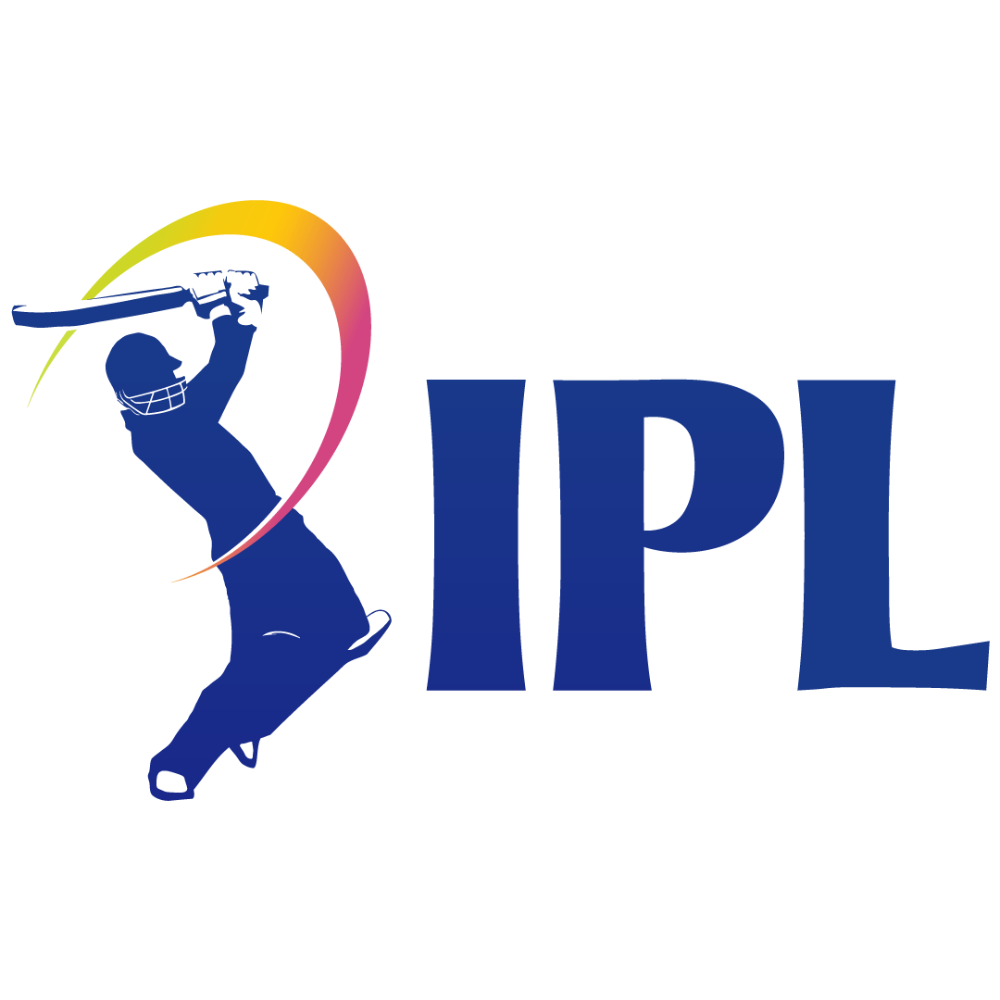

<div align="center">
  

  # 🏏 IPL Mega Auction & Fantasy Arena
  ### *The Ultimate Real-Time SaaS Auction & Live Fantasy Experience*

  [](https://reactjs.org/)
  [](https://vitejs.dev/)
  [](https://tailwindcss.com/)
  [](https://firebase.google.com/)
  [](https://cricapi.com/)

  <p align="center">
    <b>A high-performance, real-time multiplayer simulation platform designed to replicate the intensity of the official IPL auction combined with an interactive Fantasy Arena powered by real-world match scorecards.</b>
    <br />
    <a href="#-key-features">Key Features</a> •
    <a href="#-tech-stack">Tech Stack</a> •
    <a href="#-project-structure">Project Structure</a> •
    <a href="#-getting-started">Getting Started</a> •
    <a href="#-automation-scripts">Automation Scripts</a>
  </p>
</div>

---

## ✨ Key Features

<table align="center" width="100%">
  <tr>
    <td width="50%" valign="top">
      <h3>🏢 Real-Time Auction Engine</h3>
      <ul>
        <li><b>Firebase Sync:</b> Sub-second latency powered by Firebase Realtime Database.</li>
        <li><b>Universal Clock Offset:</b> Automated synchronization of bid timers across all client machines using RTDB offset.</li>
        <li><b>Flexible Auction Formats:</b>
          <ul>
            <li><b>Mega:</b> 25 squad limit, 8 overseas limit, 120 Cr budget.</li>
            <li><b>Sprint 11:</b> 11 squad limit, 4 overseas limit, 90 Cr budget.</li>
            <li><b>Sprint 5:</b> 5 squad limit, 2 overseas limit, 60 Cr budget.</li>
          </ul>
        </li>
      </ul>
    </td>
    <td width="50%" valign="top">
      <h3>🏆 Fantasy Arena</h3>
      <ul>
        <li><b>Squad Selection:</b> Draft your Playing XI, select a Captain (2x points), Vice-Captain (1.5x points), and Impact Player from your auction acquisitions.</li>
        <li><b>Real-time Leaderboard:</b> Ranks players based on actual match scores.</li>
        <li><b>Admin Console:</b> Dedicated interface for administrators to manage rooms and sync stats.</li>
      </ul>
    </td>
  </tr>
  <tr>
    <td width="50%" valign="top">
      <h3>📺 Premium Broadcast UI/UX</h3>
      <ul>
        <li><b>Sophisticated Design:</b> Sleek dark mode styling using Tailwind CSS v4 and glassmorphism.</li>
        <li><b>Micro-Animations:</b> Smoothed with Framer Motion, including confetti and animated "SOLD"/"UNSOLD" cards.</li>
        <li><b>Interactive Lobby:</b> Features team assignment tools, live chat, and kick/ban controls.</li>
      </ul>
    </td>
    <td width="50%" valign="top">
      <h3>🔌 CricAPI Live Scorecard Sync</h3>
      <ul>
        <li><b>CricAPI Integration:</b> Automated fetchers pull real scorecard stats.</li>
        <li><b>Automatic Point Calculator:</b> Converts runs, wickets, catches, and strike rates into fantasy points.</li>
        <li><b>Backfill Tools:</b> Scripts to seed and update database with historical IPL data.</li>
      </ul>
    </td>
  </tr>
</table>

---

## 🛠 Tech Stack

- **Frontend Core:** `React 19.2` + `Vite 6` (Ultra-fast Hot Module Replacement)
- **Styling:** `Tailwind CSS v4` + `Framer Motion` (Smooth animations)
- **Backend & Database:** `Firebase` (Authentication, Cloud Firestore, Realtime Database)
- **Live Stats Integration:** `CricAPI` (Match data and real-world scoreboard points)
- **Icons & Utilities:** `Lucide React`, `Canvas Confetti`, `html-to-image`
- **Future Integrations:** Prepared for `@google/generative-ai` (Gemini API) and Agora Voice Chat.

---

## 📂 Project Structure

```
ipl-auction/
├── public/                 # Static assets, sitemaps, robots.txt
├── scripts/                # Database and data synchronization scripts
│   ├── autoUpdateFantasy.js      # Auto-calculates points from live CricAPI matches
│   ├── backfillIPL2026.js        # Imports IPL series scorecards
│   ├── deployDatabaseRules.js    # Syncs rules to Firebase RTDB
│   └── uploadConsolidatedPoints.js
├── src/
│   ├── components/         # Reusable widgets (Activity feed, Chat, Footer, etc.)
│   │   └── fantasy/        # Fantasy team editor and squad preview components
│   ├── contexts/           # State management (Auction and Authentication)
│   ├── data/               # Seed data (Players list, franchises details)
│   ├── lib/                # Firebase connection helpers and config
│   ├── pages/              # Main routing pages
│   │   ├── AuctionRoom.jsx       # Interactive bidding screen
│   │   ├── AuctionSummary.jsx    # Post-auction summary and Fantasy Arena
│   │   ├── FantasyAdmin.jsx      # Admin panel for score calculations
│   │   ├── LandingPage.jsx       # Franchise marquee & Room selector
│   │   └── Lobby.jsx             # Pre-auction franchise lobby
│   ├── App.jsx             # Router and layout definitions
│   └── main.jsx            # React root mount
├── database.rules.json     # Firebase Realtime Database Security Rules
├── vite.config.js          # Vite config using `@tailwindcss/vite`
└── package.json            # Dependencies and npm script shortcuts
```

---

## 🚀 Getting Started

### Prerequisites
- Node.js (v18+)
- Firebase account and setup project
- CricAPI key (optional, required to run point synchronizer scripts)

### Installation

1. **Clone the Repository & Install Dependencies**
   ```bash
   git clone https://github.com/Shaurya01836/ipl-auction.git
   cd ipl-auction
   npm install
   ```

2. **Configure Environment Variables**
   Create a `.env` file in the root of the project:
   ```env
   VITE_FIREBASE_API_KEY=your_firebase_api_key
   VITE_FIREBASE_AUTH_DOMAIN=your_project.firebaseapp.com
   VITE_FIREBASE_DATABASE_URL=https://your_project-default-rtdb.firebaseio.com
   VITE_FIREBASE_PROJECT_ID=your_project_id
   VITE_FIREBASE_STORAGE_BUCKET=your_project.appspot.com
   VITE_FIREBASE_MESSAGING_SENDER_ID=your_messaging_sender_id
   VITE_FIREBASE_APP_ID=your_app_id
   VITE_FIREBASE_MEASUREMENT_ID=your_measurement_id
   
   # Optional: Administrative and Integration keys
   VITE_ADMIN_EMAIL=your_admin_email_to_access_fantasy_admin
   VITE_CRICKET_API_KEY=your_cricapi_key
   VITE_GEMINI_API_KEY=your_gemini_api_key
   ```

3. **Start the Development Server**
   ```bash
   npm run dev
   ```

---

## ⚙️ Automation Scripts

The project includes CLI utilities inside the `scripts/` directory to manage database configuration and sync fantasy points:

* **Sync Realtime Database Rules**
  Updates rules on Firebase to secure bidding operations:
  ```bash
  node scripts/deployDatabaseRules.js
  ```
* **Backfill Match scorecards**
  Fetches IPL matches and player points from CricAPI and registers them inside Firestore:
  ```bash
  node scripts/backfillIPL2026.js
  ```
* **Auto-Update Live Scores**
  Processes current live scorecards to update the global fantasy leaderboard:
  ```bash
  node scripts/autoUpdateFantasy.js
  ```

---

<div align="center">
  <p>Built for Cricket Fans • Designed for Pro Experience</p>
  <p>© IPL Auction Simulation Platform</p>
</div>
